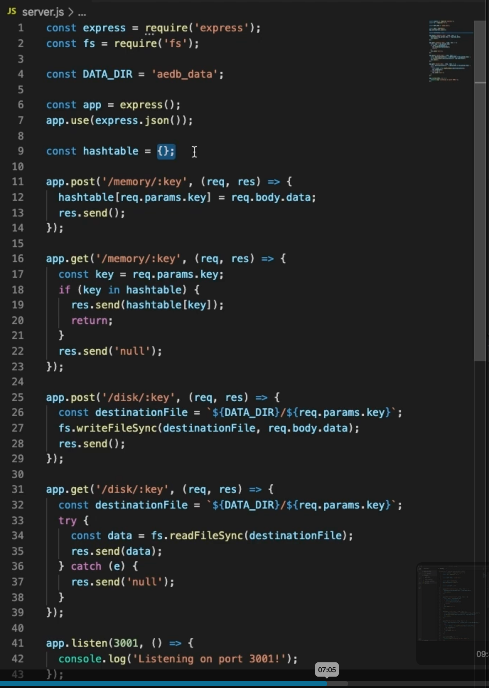

# Prerequisites

## Disk
- Refers to either:
  - **HDD** (Hard-Disk Drive).
  - **SSD** (Solid-State Drive).

- **Non-volatile storage**: Data written to disk persists through:
  - Power failures.
  - Machine crashes.

### HDD vs SSD
- **HDD**:
  - Slower but more cost-effective.
  - Typically used for data that is **rarely accessed or updated** but stored for a long time.
  
- **SSD**:
  - Much faster but more expensive.
  - Used for data that is **frequently accessed or updated**.

---

## Memory
- Short for **Random Access Memory (RAM)**.
- **Volatile storage**: Data stored in memory is lost if the process that wrote it crashes.

---

# Key Terms

## Latency
- The time it takes for a specific operation to complete in a system.  
  - Usually measured as a time duration (e.g., milliseconds or seconds).  

### Examples of Latency:
- Reading 1 MB from RAM: **250 μs (0.25 ms)**.
- Reading 1 MB from SSD: **1,000 μs (1 ms)**.
- Transferring 1 MB over a network: **10,000 μs (10 ms)**.
- Reading 1 MB from HDD: **20,000 μs (20 ms)**.
- Inter-continental round trip: **150,000 μs (150 ms)**.

---

## Throughput
- The number of operations a system can handle correctly per unit of time.  
  - Example: The throughput of a server is often measured in **requests per second (RPS)** or **queries per second (QPS)**.

# Notes from Video

## Latency
- Refers to the time it takes for data to travel between two points within a system.
  - Examples include:
    - Latency of network calls (e.g., client-server communication).
    - Latency of reading data from disk or memory.

- **System Variability**:
  - Different components within a system have varying latencies.
  - Latency can be higher or lower depending on the system's architecture.

---

## Latency vs Throughput
- While **latency** and **throughput** are related concepts, they are not directly correlated.
  - Example: A component with extremely low latency (fast response) does not imply high throughput (ability to handle many operations per unit of time).
  - Conversely, low throughput in one component does not necessarily mean high latency.

- **Key Insight**:
  - It is not possible to make assumptions about latency and throughput based solely on one another.
  - They do not have a direct correlation.

### Code Example
